# TheCocktails

## About
It simply loads data from API and stores it in persistence storage (i.e. SQLite Database).
* Use real [TheCocktailDB](https://www.thecocktaildb.com/) api. 
* Clean and Simple Compose Material UI. 
* Use Gradle version catalog and convention plugins. 
* Clean architecture and MVVM. 

## Built With 🛠
[Kotlin](https://kotlinlang.org/) - First class and official programming language for Android development. 
[Kotlin Gradle DSL](https://docs.gradle.org/current/userguide/kotlin_dsl.html) - Provides an alternative syntax to the traditional Groovy DSL for Gradle build system.  
[Coroutines](https://kotlinlang.org/docs/reference/coroutines-overview.html) - Kotlin Asynchronous or non-blocking programming. 
[Compose](https://developer.android.com/develop/ui/compose/documentation) - The modern toolkit for building native Android UI. 
[ViewModel](https://developer.android.com/topic/libraries/architecture/viewmodel) - Stores UI-related data that isn't destroyed on UI changes. 
[Jetpack Navigation](https://developer.android.com/guide/navigation) - Component helps you implement navigation. 
[Datastore](https://developer.android.com/topic/libraries/architecture/datastore) - Data storage solution that stores key-value pairs or complex typed objects. 
[Room](https://developer.android.com/topic/libraries/architecture/room) - SQLite object mapping library. 
[Hilt](https://dagger.dev/hilt/) - Easy way to incorporate Dagger dependency injection into an Android application. 
[Retrofit](https://square.github.io/retrofit/) - A type-safe HTTP client for Android and Java. 
[Coil](https://coil-kt.github.io/coil/) - An image loading library for Android. 
[Kotlin Serialization](https://kotlinlang.org/docs/serialization.html) - A modern JSON library for Kotlin and Java. 
[Testing](https://developer.android.com/training/testing) - App contains different kinds of tests: Local Unit, Integration, UI, End2End tests. 
## Module Graph

```mermaid
%%{
  init: {
    'theme': 'base',
    'themeVariables': {"primaryTextColor":"#F6F8FAff","primaryColor":"#5a4f7c","primaryBorderColor":"#5a4f7c","tertiaryColor":"#40375c","lineColor":"#f5a623","fontSize":"12px"}
  }
}%%

graph TB
  subgraph :core
    :core:common["common"]
    :core:domain["domain"]
    :core:ui["ui"]
    :core:testing["testing"]
    :core:data-test["data-test"]
    :core:data["data"]
    :core:database["database"]
    :core:datastore["datastore"]
    :core:network["network"]
  end
  subgraph :feature
    :feature:settings["settings"]
    :feature:glasses-list["glasses-list"]
    :feature:categories-list["categories-list"]
    :feature:cocktails-list["cocktails-list"]
    :feature:cocktail-details["cocktail-details"]
    :feature:ingredients-list["ingredients-list"]
    :feature:home["home"]
  end
  :feature:settings --> :core:common
  :feature:settings --> :core:domain
  :feature:settings --> :core:ui
  :feature:glasses-list --> :core:testing
  :feature:glasses-list --> :core:common
  :feature:glasses-list --> :core:domain
  :feature:glasses-list --> :core:ui
  :app --> :core:testing
  :app --> :core:data-test
  :app --> :core:data
  :app --> :core:domain
  :app --> :core:ui
  :app --> :feature:categories-list
  :app --> :feature:cocktails-list
  :app --> :feature:cocktail-details
  :app --> :feature:glasses-list
  :app --> :feature:ingredients-list
  :app --> :feature:home
  :app --> :feature:settings
  :core:testing --> :core:common
  :core:testing --> :core:domain
  :core:data --> :core:database
  :core:data --> :core:datastore
  :core:data --> :core:domain
  :core:data --> :core:common
  :core:data --> :core:network
  :core:network --> :core:common
  :feature:categories-list --> :core:testing
  :feature:categories-list --> :core:common
  :feature:categories-list --> :core:domain
  :feature:categories-list --> :core:ui
  :feature:cocktail-details --> :core:common
  :feature:cocktail-details --> :core:domain
  :feature:cocktail-details --> :core:ui
  :feature:home --> :core:testing
  :feature:home --> :core:common
  :feature:home --> :core:domain
  :feature:home --> :core:ui
  :feature:cocktails-list --> :core:common
  :feature:cocktails-list --> :core:domain
  :feature:cocktails-list --> :core:ui
  :core:domain --> :core:common
  :core:datastore --> :core:common
  :core:data-test --> :core:common
  :core:data-test --> :core:network
  :core:data-test --> :core:database
  :core:data-test --> :core:data
  :core:data-test --> :core:domain
  :feature:ingredients-list --> :core:common
  :feature:ingredients-list --> :core:domain
  :feature:ingredients-list --> :core:ui

classDef android-library fill:#3BD482,stroke:#fff,stroke-width:2px,color:#fff;
classDef kotlin-jvm fill:#2C4162,stroke:#fff,stroke-width:2px,color:#fff;
classDef android-application fill:#2C4162,stroke:#fff,stroke-width:2px,color:#fff;
class :feature:settings android-library
class :core:common kotlin-jvm
class :core:domain android-library
class :core:ui android-library
class :feature:glasses-list android-library
class :core:testing android-library
class :app android-application
class :core:data-test android-library
class :core:data android-library
class :feature:categories-list android-library
class :feature:cocktails-list android-library
class :feature:cocktail-details android-library
class :feature:ingredients-list android-library
class :feature:home android-library
class :core:database android-library
class :core:datastore android-library
class :core:network android-library

```

## Architecture
This repository uses recommended Android [App architecture](https://developer.android.com/topic/architecture).
